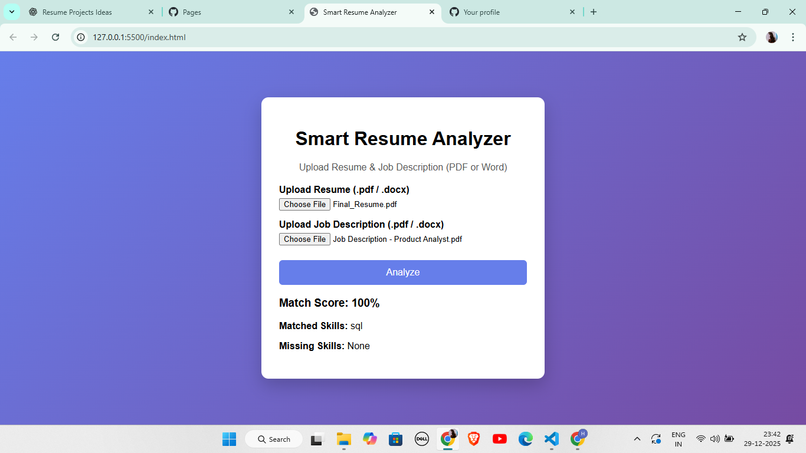

# Smart Resume Analyzer

A web-based application that analyzes
resumes against job descriptions
and calculates skill match percentage.

## Project Preview

## Features
- Upload resume and job description (PDF / Word)
- Text extraction using PDF.js and Mammoth.js
- Skill match percentage calculation
